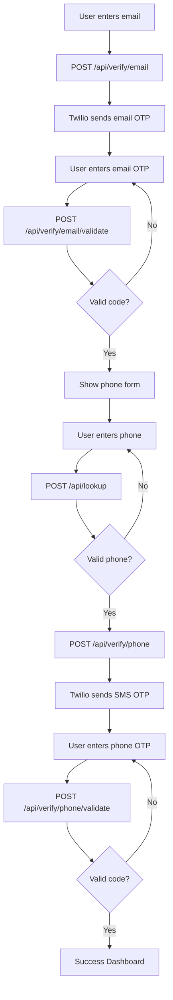

# Forge Access Granted – Onboarding Flow Runbook

> **Project:** Multi-Step Onboarding with Email & Phone Verification  
> **Focus:** Seamless User Verification Using Twilio Verify & Lookup  
> **Tech Stack:** Node.js (Fastify), Twilio Verify, Twilio Lookup, Vanilla JS  
> **Duration:** ~60 min to build  
> **Outcome:** Complete onboarding flow with email/phone verification

---

## Table of Contents

1. [Overview](#overview)
2. [Prerequisites](#prerequisites)
3. [Architecture](#architecture)
4. [Setup](#setup)
5. [Step 1: Project Structure](#step-1-project-structure)
6. [Step 2: Backend API Implementation](#step-2-backend-api-implementation)
7. [Step 3: Frontend Implementation](#step-3-frontend-implementation)
8. [Step 4: End-to-End Flow](#step-4-end-to-end-flow)
9. [Step 5: Testing & Validation](#step-5-testing--validation)
10. [Troubleshooting](#troubleshooting)
11. [Best Practices & Next Steps](#best-practices--next-steps)
12. [Appendix: Key Resources](#appendix-key-resources)

---

## Overview

This runbook guides you through building a complete multi-step user onboarding flow with email and phone verification using Twilio services. The application provides a smooth user experience with proper validation, error handling, and responsive design.

**Key Features:**
- **Email Verification:** Send and validate OTP codes via email
- **Phone Verification:** Lookup phone validity and send SMS OTP
- **Multi-Step Flow:** Progressive onboarding with clear step transitions
- **Error Handling:** Graceful error handling with user-friendly messages
- **Modular Code:** Clean, maintainable frontend and backend architecture

**User Journey:**
1. User enters email → Receives email OTP → Validates code
2. User enters phone → Phone lookup validation → Receives SMS OTP → Validates code
3. Success dashboard displayed

---

## Prerequisites

- **Node.js** (v18+ recommended)
- **Twilio Account** with Verify & Lookup services enabled
- **Twilio Credentials:** `TWILIO_ACCOUNT_SID`, `TWILIO_AUTH_TOKEN`, `TWILIO_VERIFY_SERVICE_SID`
  - **`TWILIO_ACCOUNT_SID`**: Your unique Twilio Account identifier
    - **Where to find:** [Twilio Console Dashboard](https://console.twilio.com/) - displayed prominently on the main dashboard
    - **Format:** Starts with "AC" followed by 32 hexadecimal characters (e.g., `ACxxxxxxxxxxxxxxxxxxxxxxxxxxxxxxxx`)
    - **Documentation:** [Finding your Account SID](https://www.twilio.com/docs/usage/your-request-to-twilio#account-sid)
  - **`TWILIO_AUTH_TOKEN`**: Your secret authentication token for API access
    - **Where to find:** [Twilio Console Dashboard](https://console.twilio.com/) - click "Show" next to Auth Token (keep this secret!)
    - **Format:** 32 hexadecimal characters
    - **Security:** Never expose this in client-side code or public repositories
    - **Documentation:** [Authentication and API Keys](https://www.twilio.com/docs/iam/api-keys)
  - **`TWILIO_VERIFY_SERVICE_SID`**: Identifier for your Twilio Verify service instance
    - **Where to find:** [Twilio Console > Verify > Services](https://console.twilio.com/us1/develop/verify/services) - create a new service or use existing one
    - **Format:** Starts with "VA" followed by 32 hexadecimal characters (e.g., `VAxxxxxxxxxxxxxxxxxxxxxxxxxxxxxxxx`)
    - **Setup Guide:** [Create a Verify Service](https://www.twilio.com/docs/verify/api/service)
    - **Required for:** Sending and validating OTP codes via email/SMS
- **Basic knowledge:** JavaScript/Node.js, HTML/CSS, HTTP APIs

### Environment Variables

Create a `.env` file in your project root:

```env
TWILIO_ACCOUNT_SID=ACXXXXXXXXXXXXXXXXXXXXXXXXXXXXXXXXX
TWILIO_AUTH_TOKEN=your_auth_token_here
TWILIO_VERIFY_SERVICE_SID=VAXXXXXXXXXXXXXXXXXXXXXXXXXXXXXXXXX
PORT=3000
```

**Note:** Never commit `.env` to version control. Use `.env.example` as a sample and copy it over to `.env`.

---

## Architecture



**Technology Stack:**
- **Backend:** Fastify (lightweight, fast Node.js framework)
- **Verification:** Twilio Verify API (email + SMS OTP)
- **Validation:** Twilio Lookup API (phone number validation)
- **Frontend:** Vanilla HTML/CSS/JS (modular, no frameworks)

---

## Setup

### 1. Project Initialization

```bash
# Clone or create project directory
mkdir forge-access-granted
cd forge-access-granted

# Initialize npm project
npm init -y

# Install dependencies
npm install fastify @fastify/static twilio dotenv
```

### 2. Directory Structure

```
forge-access-granted/
├── .env                    # Environment variables (not in git)
├── .env.example           # Environment template
├── .gitignore             # Git ignore file
├── package.json           # Project dependencies
├── server.js              # Main server file
├── runbook.md             # This file
└── public/                # Static frontend files
    ├── index.html         # Main HTML page
    ├── style.css          # Styling
    └── main.js            # Frontend JavaScript
```

---

## Step 1: Project Structure

### Create Core Files

**package.json dependencies:**

```json
{
  "dependencies": {
    "@fastify/static": "^6.12.0",
    "dotenv": "^16.4.5",
    "fastify": "^4.27.2",
    "twilio": "^4.19.0"
  }
}
```

**.gitignore:**

```gitignore
node_modules/
.DS_Store
.env
dist/
coverage/
.vscode/
npm-debug.log*
yarn-debug.log*
yarn-error.log*
.pnpm-debug.log*
```

**.env.example:**

```env
TWILIO_ACCOUNT_SID=your_account_sid
TWILIO_AUTH_TOKEN=your_auth_token
TWILIO_VERIFY_SERVICE_SID=your_verify_service_sid
PORT=3000
```

---

## Step 2: Backend API Implementation

### Main Server Setup (server.js)

```javascript
require('dotenv').config();
const path = require('path');
const Fastify = require('fastify');
const fastifyStatic = require('@fastify/static');
const twilio = require('twilio');

const app = Fastify({ logger: true });

// Serve static files
app.register(fastifyStatic, {
  root: path.join(__dirname, 'public'),
  prefix: '/',
});

// Twilio setup
const client = twilio(process.env.TWILIO_ACCOUNT_SID, process.env.TWILIO_AUTH_TOKEN);
const VERIFY_SERVICE_SID = process.env.TWILIO_VERIFY_SERVICE_SID;
```

### API Endpoints

**Phone Lookup (validates phone numbers):**

```javascript
app.post('/api/lookup', async (req, reply) => {
  const { phone } = req.body;
  if (!phone) return reply.code(400).send({ error: 'Phone required' });
  
  try {
    const result = await client.lookups.v2.phoneNumbers(phone).fetch();
    // Extract only essential info to avoid circular reference issues
    reply.send({ 
      valid: true, 
      phoneNumber: result.phoneNumber,
      nationalFormat: result.nationalFormat,
      countryCode: result.countryCode,
      callingCountryCode: result.callingCountryCode
    });
  } catch (err) {
    reply.code(400).send({ valid: false, error: err.message });
  }
});
```

**Email Verification:**

```javascript
// Start email verification
app.post('/api/verify/email', async (req, reply) => {
  const { email } = req.body;
  if (!email) return reply.code(400).send({ error: 'Email required' });
  
  try {
    await client.verify.v2.services(VERIFY_SERVICE_SID).verifications.create({
      to: email,
      channel: 'email',
    });
    reply.send({ success: true });
  } catch (err) {
    reply.code(400).send({ success: false, error: err.message });
  }
});

// Validate email verification
app.post('/api/verify/email/validate', async (req, reply) => {
  const { email, code } = req.body;
  if (!email || !code) return reply.code(400).send({ error: 'Email and code required' });
  
  try {
    const result = await client.verify.v2.services(VERIFY_SERVICE_SID).verificationChecks.create({
      to: email,
      code,
    });
    reply.send({ valid: result.status === 'approved' });
  } catch (err) {
    reply.code(400).send({ valid: false, error: err.message });
  }
});
```

**Phone Verification:**

```javascript
// Start phone verification
app.post('/api/verify/phone', async (req, reply) => {
  const { phone } = req.body;
  if (!phone) return reply.code(400).send({ error: 'Phone required' });
  
  try {
    await client.verify.v2.services(VERIFY_SERVICE_SID).verifications.create({
      to: phone,
      channel: 'sms',
    });
    reply.send({ success: true });
  } catch (err) {
    reply.code(400).send({ success: false, error: err.message });
  }
});

// Validate phone verification
app.post('/api/verify/phone/validate', async (req, reply) => {
  const { phone, code } = req.body;
  if (!phone || !code) return reply.code(400).send({ error: 'Phone and code required' });
  
  try {
    const result = await client.verify.v2.services(VERIFY_SERVICE_SID).verificationChecks.create({
      to: phone,
      code,
    });
    reply.send({ valid: result.status === 'approved' });
  } catch (err) {
    reply.code(400).send({ valid: false, error: err.message });
  }
});
```

**Server Startup:**

```javascript
// Fallback: serve index.html for all other routes
app.setNotFoundHandler((req, reply) => {
  reply.sendFile('index.html');
});

// Start server
const PORT = process.env.PORT || 3000;
app.listen({ port: PORT, host: '0.0.0.0' }, err => {
  if (err) throw err;
  console.log(`Server running on http://localhost:${PORT}`);
});
```

---

## Step 3: Frontend Implementation

### HTML Structure (public/index.html)

```html
<!DOCTYPE html>
<html lang="en">
<head>
  <meta charset="UTF-8">
  <meta name="viewport" content="width=device-width, initial-scale=1.0">
  <title>Onboarding Flow</title>
  <link rel="stylesheet" href="/style.css">
</head>
<body>
  <div id="app">
    <!-- Step 1: Email input -->
    <form id="email-form" class="step">
      <h2>Enter your email</h2>
      <input type="email" id="email" required placeholder="Email address" />
      <button type="submit">Send OTP</button>
      <div class="error" id="email-error"></div>
    </form>
    
    <!-- Step 2: Email OTP -->
    <form id="email-otp-form" class="step" style="display:none">
      <h2>Enter the 6-digit code sent to your email</h2>
      <input type="text" id="email-otp" maxlength="6" pattern="\d{6}" required placeholder="123456" />
      <button type="submit">Verify</button>
      <div class="error" id="email-otp-error"></div>
    </form>
    
    <!-- Step 3: Phone input -->
    <form id="phone-form" class="step" style="display:none">
      <h2>Enter your phone number</h2>
      <input type="tel" id="phone" required placeholder="+1234567890" />
      <button type="submit">Send OTP</button>
      <div class="error" id="phone-error"></div>
    </form>
    
    <!-- Step 4: Phone OTP -->
    <form id="phone-otp-form" class="step" style="display:none">
      <h2>Enter the 6-digit code sent to your phone</h2>
      <input type="text" id="phone-otp" maxlength="6" pattern="\d{6}" required placeholder="123456" />
      <button type="submit">Verify</button>
      <div class="error" id="phone-otp-error"></div>
    </form>
    
    <!-- Step 5: Success Dashboard -->
    <div id="dashboard" class="step" style="display:none">
      <h2>Welcome!</h2>
      <p>You have completed onboarding successfully.</p>
    </div>
  </div>
  <script src="/main.js"></script>
</body>
</html>
```

### CSS Styling (public/style.css)

```css
body {
  font-family: system-ui, sans-serif;
  background: #f6f8fa;
  margin: 0;
  padding: 0;
}

#app {
  max-width: 350px;
  margin: 60px auto;
  background: #fff;
  border-radius: 8px;
  box-shadow: 0 2px 8px rgba(0,0,0,0.07);
  padding: 32px 24px;
}

h2 {
  margin-top: 0;
  font-size: 1.3em;
}

input[type="email"],
input[type="tel"],
input[type="text"] {
  width: 100%;
  padding: 10px;
  margin: 12px 0 16px 0;
  border: 1px solid #d0d7de;
  border-radius: 4px;
  font-size: 1em;
}

button {
  width: 100%;
  padding: 10px;
  background: #0969da;
  color: #fff;
  border: none;
  border-radius: 4px;
  font-size: 1em;
  cursor: pointer;
  margin-bottom: 8px;
}

button:disabled {
  background: #b6c6e3;
  cursor: not-allowed;
}

.error {
  color: #d73a49;
  font-size: 0.95em;
  min-height: 1.2em;
}

#dashboard {
  text-align: center;
}
```

### JavaScript Application (public/main.js)

The frontend JavaScript follows a modular pattern with clear separation of concerns:

```javascript
/**
 * Onboarding Flow Application
 * Multi-step user verification with email and phone
 */
const OnboardingFlow = (() => {
  
  /* ===== CONFIGURATION ===== */
  const selectors = {
    emailForm: '#email-form',
    emailOtpForm: '#email-otp-form',
    phoneForm: '#phone-form',
    phoneOtpForm: '#phone-otp-form',
    dashboard: '#dashboard',
    // ... (see main.js for complete implementation)
  };

  /* ===== APPLICATION STATE ===== */
  const state = {
    userEmail: '',
    userPhone: ''
  };

  // ... (see main.js for complete implementation)
})();

document.addEventListener('DOMContentLoaded', OnboardingFlow.init);
```

---

## Step 4: End-to-End Flow

### Complete User Journey

1. **Email Verification Step:**
   - User enters email address
   - Frontend validates email format
   - Backend sends email OTP via Twilio Verify
   - User receives email with 6-digit code
   - User enters code and validates

2. **Phone Verification Step:**
   - User enters phone number in international format (+1234567890)
   - Frontend validates phone format
   - Backend validates phone via Twilio Lookup
   - If valid, backend sends SMS OTP via Twilio Verify
   - User receives SMS with 6-digit code
   - User enters code and validates

3. **Success:**
   - Both email and phone verified
   - Success dashboard displayed
   - User onboarding complete

### Error Handling

- **Invalid inputs:** Client-side validation with user-friendly messages
- **Network errors:** Graceful error handling with retry capability
- **Invalid phone:** Twilio Lookup prevents SMS to invalid numbers
- **Invalid OTP:** Clear error messages for wrong verification codes
- **Twilio API errors:** Backend error handling with informative responses

---

## Step 5: Testing & Validation

### Manual Testing Checklist

**Email Verification:**
- [ ] Valid email formats accepted
- [ ] Invalid email formats rejected
- [ ] Email OTP received in inbox/spam
- [ ] Correct OTP code validates successfully
- [ ] Incorrect OTP code shows error
- [ ] Network errors handled gracefully

**Phone Verification:**
- [ ] Valid phone formats (+1234567890) accepted
- [ ] Invalid phone formats rejected
- [ ] Invalid phone numbers rejected by Lookup
- [ ] SMS OTP received on mobile device
- [ ] Correct OTP code validates successfully
- [ ] Incorrect OTP code shows error

**UI/UX:**
- [ ] Step transitions work smoothly
- [ ] Loading states (disabled buttons) work
- [ ] Error messages display clearly
- [ ] Success state displays correctly
- [ ] Responsive design on mobile/desktop

### Quick Test Commands

```bash
# Start the server
npm start

# Test API endpoints with curl
curl -X POST http://localhost:3000/api/verify/email \
  -H "Content-Type: application/json" \
  -d '{"email":"test@example.com"}'

curl -X POST http://localhost:3000/api/lookup \
  -H "Content-Type: application/json" \
  -d '{"phone":"+15551234567"}'
```

---

## Troubleshooting

### Common Issues & Solutions

**1. "TypeError: Converting circular structure to JSON"**
- **Cause:** Spreading entire Twilio response object (`...result`)
- **Fix:** Extract only needed properties from Twilio responses
- **Example:** Use `{ phoneNumber: result.phoneNumber }` instead of `...result`

**2. "Username is required" Twilio Error**
- **Cause:** Missing or incorrect Twilio credentials
- **Fix:** Verify `.env` file exists with correct `TWILIO_ACCOUNT_SID` and `TWILIO_AUTH_TOKEN`
- **Check:** Environment variables loaded with `console.log(process.env.TWILIO_ACCOUNT_SID)`

**3. Email OTP Not Received**
- **Cause:** Email delivery issues or spam filtering
- **Fix:** Check spam folder, verify email address, use test email services
- **Debug:** Check Twilio Console logs for delivery status

**4. SMS OTP Not Received**
- **Cause:** Invalid phone number, regional restrictions, or carrier issues
- **Fix:** Use valid mobile numbers, check Twilio Console for delivery logs
- **Test:** Try with verified phone numbers first

**5. Frontend Steps Not Transitioning**
- **Cause:** JavaScript errors or DOM element issues
- **Fix:** Check browser console for errors, verify element IDs match selectors
- **Debug:** Add console.log statements in step transition functions

### Debug Mode

Add debug logging to server.js:

```javascript
// Add after Twilio client setup
if (process.env.NODE_ENV === 'development') {
  app.addHook('preHandler', async (request, reply) => {
    console.log(`${request.method} ${request.url}`);
    console.log('Body:', request.body);
  });
}
```

---

## Best Practices & Next Steps

### Security Considerations

- **Rate Limiting:** Implement rate limiting for OTP endpoints
- **Input Validation:** Validate all inputs on both client and server
- **CSRF Protection:** Add CSRF tokens for production use
- **Environment Variables:** Never commit secrets to version control
- **HTTPS:** Use HTTPS in production for secure data transmission

### Performance Optimizations

- **Caching:** Cache Twilio client instances
- **Connection Pooling:** Use connection pooling for database operations
- **Minification:** Minify CSS/JS for production
- **CDN:** Serve static assets via CDN

### Production Readiness

```javascript
// Add to server.js for production
if (process.env.NODE_ENV === 'production') {
  // Trust proxy headers
  app.register(require('@fastify/helmet'));
  app.register(require('@fastify/rate-limit'), {
    max: 5,
    timeWindow: '1 minute'
  });
}
```

### Monitoring & Analytics

- **Logging:** Implement structured logging with Winston or Pino
- **Metrics:** Track conversion rates for each onboarding step
- **Error Tracking:** Use Sentry or similar for error monitoring
- **Twilio Analytics:** Monitor delivery rates in Twilio Console

### Feature Extensions

- **Social Login:** Add Google/Apple sign-in options
- **Multi-Language:** Internationalization support
- **Custom Branding:** Configurable themes and styling
- **Admin Dashboard:** View onboarding metrics and user management
- **WhatsApp Support:** Add WhatsApp as verification channel

---

## Appendix: Key Resources

### Twilio Documentation
- [Twilio Verify API Documentation](https://www.twilio.com/docs/verify/api)
- [Twilio Lookup API Documentation](https://www.twilio.com/docs/lookup/api)
- [Verify Quickstart (Node.js)](https://www.twilio.com/docs/verify/quickstarts/node-js)
- [Lookup Quickstart (Node.js)](https://www.twilio.com/docs/lookup/quickstarts/node-js)

### Fastify Documentation
- [Fastify Official Documentation](https://www.fastify.io/docs/latest/)
- [Fastify Static Plugin](https://github.com/fastify/fastify-static)
- [Fastify Best Practices](https://www.fastify.io/docs/latest/Guides/Getting-Started/)

### Development Tools
- [Twilio CLI](https://www.twilio.com/docs/twilio-cli/quickstart)
- [ngrok](https://ngrok.com/) (for local development with webhooks)
- [Postman Collection](https://www.postman.com/) (for API testing)

### Code Examples
- [Twilio Verify Code Samples](https://github.com/TwilioDevEd/verify-v2-quickstart-node)
- [Fastify Examples](https://github.com/fastify/fastify/tree/main/examples)

---

## FAQ

**Q: Can this be integrated with existing authentication systems?**
A: Yes, this verification flow can be plugged into Auth0, Firebase Auth, or custom authentication systems as a verification step.

**Q: What if Twilio Lookup is not available in my region?**
A: Implement fallback validation using regex patterns and consider using alternative phone validation services.

**Q: How do I test WhatsApp verification?**
A: WhatsApp requires sandbox setup and opt-in process. See [Twilio WhatsApp Sandbox](https://www.twilio.com/docs/whatsapp/sandbox) for testing.

**Q: Can I customize the email templates?**
A: Yes, you can create custom email templates in your Twilio Console under Verify > Email Templates.

**Q: How do I handle international phone numbers?**
A: Always use E.164 format (+1234567890) and validate using Twilio Lookup for international compatibility.

**Q: What's the cost for verification?**
A: Check [Twilio Pricing](https://www.twilio.com/pricing/verify) for current rates. Costs vary by channel (SMS, email, voice).

---

## Done? Celebrate! 🎉

You've built a production-ready, multi-step onboarding flow with:
✅ Email verification with OTP  
✅ Phone verification with SMS OTP  
✅ Phone number validation via Lookup  
✅ Responsive, user-friendly interface  
✅ Robust error handling  
✅ Modular, maintainable code  

Ready for production? Add monitoring, implement rate limiting, and integrate with your authentication system.

---

> **Need help?**  
> Check the [Twilio Documentation](https://www.twilio.com/docs) or reach out to the Twilio community.
